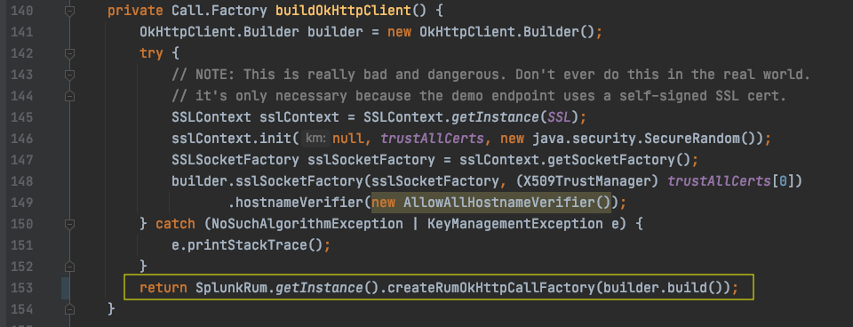

## Part 3: Add http client instrumentation

The Splunk Android library includes instrumentation for okhttp clients. In this part of the workshop, you'll use it when
configuring the okhttp client that is used in the sample app.

| Objective  | To add OpenTelemetry okhttp client instrumentation to the app and see client request metrics in the Splunk RUM product. |
| ---        | ---           |
| Duration   | 5-10 minutes  | 
| Difficulty | Medium        |

1. All the app's interactions with okhttp are found in the `com.splunk.android.workshopapp.FirstFragment` class. Open up
   that class in Android Studio.
2. Find the `buildOkHttpClient()` method.
3. Change the last line of the method to read:
   ```
   return SplunkRum.getInstance().createRumOkHttpCallFactory(builder.build());
   ```
   Remember to add an import for the `com.splunk.rum.SplunkRum` class when prompted by Android Studio.
4. Here's what the `buildOkHttpClient()` method should look like now: 
5. Build and restart the app. Now try generating some http traffic by using the 3 buttons on the first screen of the app
   labeled "LOGIN", "HTTP NOT FOUND", and "HTTP ERROR".
6. Navigate to the Splunk RUM page in the Splunk Observability product.
    1. Filter for your app and environment.
    2. Try clicking on the http metrics and finding example sessions for the results. (These metrics are "Endpoint
       Errors" and "Endpoint Latency")

---
In the next part of the workshop, you'll be adding some custom instrumentation and exploring the 
extended API provided by the Splunk RUM Android instrumentation library.

Next: [Part 4: Add some manual instrumentation](part_four.md)
