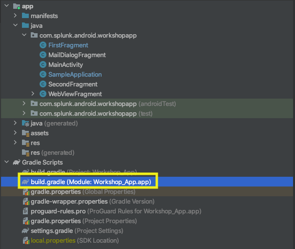
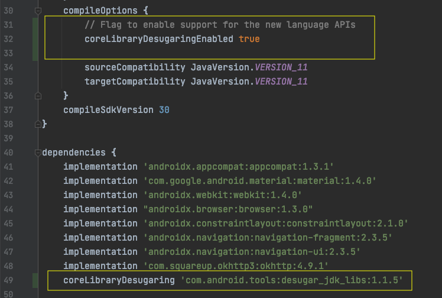
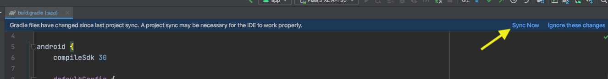
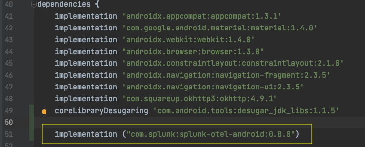
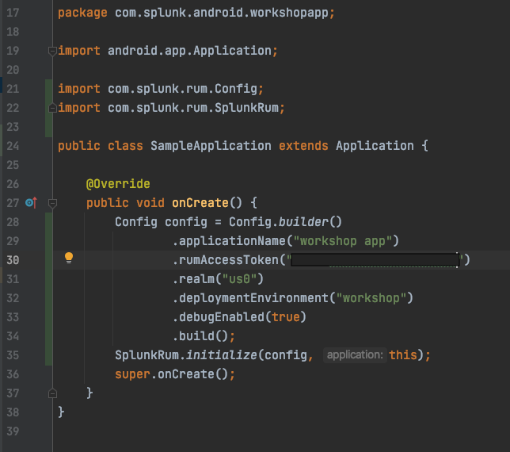

## Part 2: Add RUM instrumentation

In part 2, you'll add the dependency on the Splunk Android RUM library, making sure that core library desugaring had
been enabled. You'll write a simple configuration for the library, and run the application. If all goes as planned,
telemetry data will appear in the RUM product, and you'll be able to see recording of app startup and activity/fragment
tracking as you navigate around the app.

| Objective  | To add RUM instrumentation to the app and see data in the Splunk RUM product. |
| ---        | ---
| Duration   | 10-15 minutes | 
| Difficulty | Medium        |

1. In Android Studio, open up the `build.gradle` file for the app module (not the root `build.gradle`). If you're using
   the default "Android" view style for the project, this will be under the "`Gradle Scripts`" folder, and labeled
   something like "`build.gradle (Module: Workshop_App.app)`". This file can be found in
   the `tracing-examples/android/workshop/app` directory, for reference. Don't try to mess around with
   the `build.gradle` file in the `tracing-examples/android/workshop`
   directory. 
2. Add support
   for "[core library desugaring](https://developer.android.com/studio/write/java8-support#library-desugaring)"
   Desugaring is important because both the Splunk Android RUM library and the underlying OpenTelemetry libraries use
   Java 8 language features extensively. Without desugaring support enabled, many Java 8 classes and features will not
   be available to the app at runtime and it will crash.
    1. Update the `compileOptions` section to look like this, adding the line to enable core library desugaring.
       ```
       compileOptions {
         // Flag to enable support for the new language APIs
         coreLibraryDesugaringEnabled true
         
         sourceCompatibility JavaVersion.VERSION_11
         targetCompatibility JavaVersion.VERSION_11
       }
       ```
    2. In the `dependencies` block, add this dependency on the desugar_jdk_libs library:
       ```
       coreLibraryDesugaring 'com.android.tools:desugar_jdk_libs:1.1.5'
       ```
    3. This is what your changes should look like:
    4. Click the "Sync Now" prompt at the top of Android Studio, build the app and run it to make sure everything is
       still working as before. 
3. Add the dependency on the [splunk-otel-android](https://github.com/signalfx/splunk-otel-android) library
    1. In the `dependencies` block, add this dependency (note: if there is
       a [more recent version published](https://github.com/signalfx/splunk-otel-android/releases), please use it):
       ```
       implementation ("com.splunk:splunk-otel-android:0.8.0")
       ```
    2. Your dependency block should now look like this:
       
    3. Click the "Sync Now" prompt at the top of Android Studio, build the app and run it to make sure everything is
       still working as before. 
4. Next, we're going to create some configuration for the instrumentation. In general, you need to provide 3 things to
   set up instrumentation: your RUM access token, your Splunk realm, and the name of your app.
    1. Open up the `com.splunk.android.workshopapp.SampleApplication` class in Android Studio
        1. You can do by opening up the app/java/com/splunk/android/workshopapp folder in the project view.
        2. Bonus: Use the Android Studio keyboard shortcut "Navigate to Class" to open this java file.
    2. Insert the following at the beginning of the `onCreate()` method. Use your actual rumAccessToken and realm:
        ```
          Config config = Config.builder()
                  .applicationName("workshop app")
                  .rumAccessToken("<token>")
                  .realm("<realm>")
                  .deploymentEnvironment("workshop")
                  .debugEnabled(true)
                  .build();
          SplunkRum.initialize(config, this);
        ``` 
       When prompted by Android studio, add the imports for `com.splunk.rum.Config`
       and `com.splunk.rum.SplunkRum`
       classes to the file. Note: we're enabling debug mode here to help us debug any issues we might see during the
       workshop. In actual application, we would probably do that conditionally based on some app configuration.
    3. Feel free to change the `applicationName` and `deploymentEnvironment` options as you desire. These will be
       visible in the RUM UI, so you can customize this to make it easier for you to find your specific instance.
    4. Here is an example of what your Application class should now look like: 
5. Build and run the application. Click around the app a bit to generate some data.
6. Navigate to the Splunk RUM page in the Splunk Observability product.
    1. You should be able to select your app name, and the environment that you set in the config to filter to the
       metrics that are generated by your app.
    2. Note: it may take a few minutes for the data to show up the first time that you have done this.
    3. Have fun looking at the data!
7. Bonus:
    1. Try different things in the app. Can you find the corresponding spans and metrics in the UI?
    2. Try clicking the "Crash" button in the app. What do you see in the RUM UI that might reflect that?

---
In the next part of the workshop, you'll add OpenTelemetry instrumentation for the okhttp client and observe the spans
and metrics for http calls made from the app.

Next: [Part 3: Add http client instrumentation](part_three.md)
