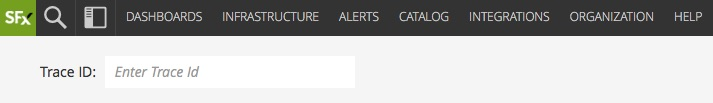
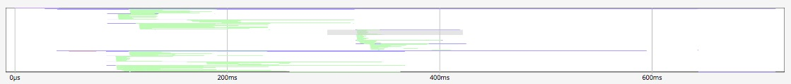
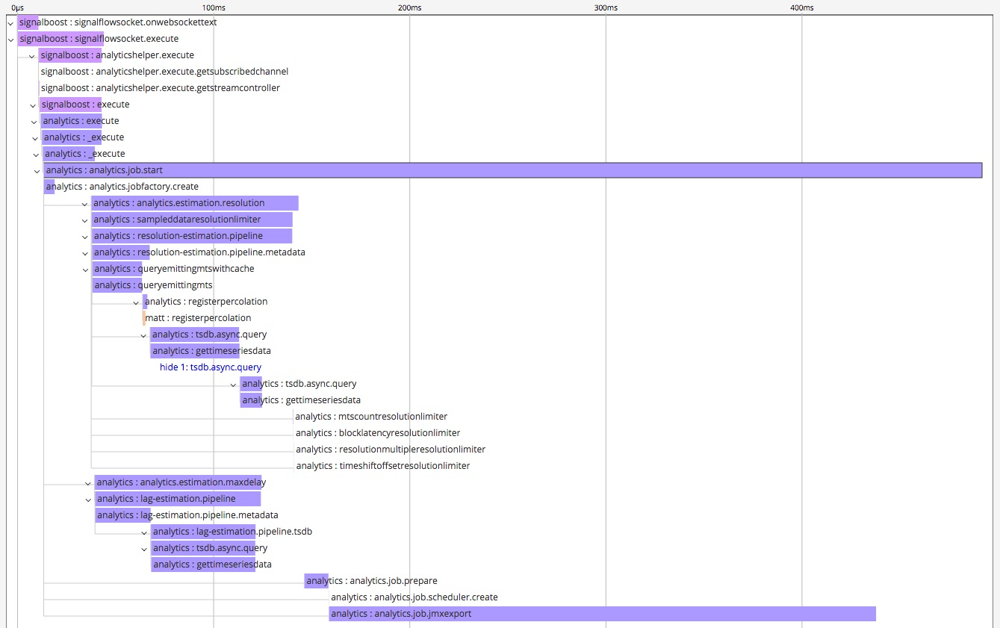
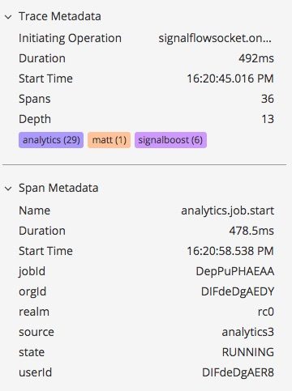

# Distributed Tracing & Microservices APM Early Access Program

## Overview

New applications and existing monolithic apps are being decomposed into
distributed service-oriented/microservices-based software systems using various
tools, languages, frameworks and cloud services. These new environments require
a new way to understand user transactions that flow across service boundaries
with a transaction going through 10s/100s of services to complete a single user
request.

SignalFx's Distributed tracing will offer unique insights into distributed
applications - performance and troubleshooting - complementing metrics-based
monitoring approach; by utilizing our class-leading real-time metrics analytics
platform, we intend to make distributed tracing useful beyond end-to-end
troubleshooting and uplevel it to a performance optimization solution by
applying real-time analytics to span/trace data.

Some key functionality we intend to deliver over the coming year includes:

* Ingesting, storing and visualizing instrumentation agnostic trace data
* Rapid end-to-end troubleshooting with service maps, slice/dice
  high-cardinality spans, trace latency histogram
* RED Metrics for spans, per end-point & service profiles and built-in alerts
* Dependency-aware alerting & troubleshooting to get you to root cause rapidly
* Infra metrics related to spans/traces to help with problem isolation quickly

## Early Access Program

Our Early Access Program (EAP) for Distributed Tracing is intended for early
interaction, engagement and feedback with a select set of customers that we
consider design partners on the journey to delivering a best in class
distributed tracing and microservices APM solution. This EAP is intended to give
you access to new features as we're building them - as such, they should be
considered "alpha quality": you may experience bugs or user experience nits
along the way and we'll be looking forward to your feedback as we continue to
build this new and exciting facet of SignalFx's offering.

In it's first phase, June 2018, we are starting with the ability to ingest spans
sent to us using Zipkin's v2 JSON wire format and visualize specific traces
directly by trace ID. We will continue to rapidly add functionality mentioned
above with a monthly/quaterly cadence and expect to receive candid feedback from
this Early Access group so we can continue to iterate towards an outstanding
product that solves customer problems in truly unique, innovative ways.

### Feedback and support requests

For the duration of this Early Access Program for our Distributed Tracing & APM
features, please refrain from using our normal support channels and direct all
your feedback and questions via email to `tracing-feedback@signalfx.com`.

## Instrumentation

Akin to our approach for metrics instrumentation, SignalFx intends to remain as
instrumentation-agnostic as possible, leveraging open-source and open standards
for client-side tracing instrumentation and wire formats. We intend to ingest
spans in Zipkin's JSON formats (both v1 and v2) in the Early Access Program and
add support for Jaeger's wire format, OpenCensus, and AWS X-Ray later in the
year. We've developed a normalized data model to ingest & represent different
formats so you can use SignalFx to provide powerful real-time data exploration
capabilities and easy-to-use trace visualization and analysis features for the
instrumentation of your choice.

<p align="center">
  <a href="https://signalfx.com">
  </a>
  &nbsp;&nbsp;
  <a href="https://opentracing.io">
  </a>
  &nbsp;&nbsp;
  <a href="https://zipkin.io">
  </a>
</p>

## Sending trace data to SignalFx

SignalFx's ingest API now exposes a new endpoint for ingesting trace data,
available at `https://ingest.signalfx.com/v1/trace`. As of June 2018, this
endpoint accepts lists of spans encoded in [Zipkin's JSON
formats](https://zipkin.io/zipkin-api/) (both v1 and v2 encodings).

Like the rest of SignalFx's APIs, you need to provide a valid `X-SF-Token`
header. You may also compress the payload with GZip and set the
`Content-Encoding: gzip` as necessary.

The endpoint will return a JSON document describing how many spans were valid
and accepted, and what spans were rejected (and for what reason), if any.

```
POST /v1/trace HTTP/1.1
Host: ingest.signalfx.com
X-SF-Token: <your-token>
Content-Type: application/json

[{...},{...},{...}]

HTTP/1.1 200 OK
Content-Length: 24
Content-Type: application/json; charset=utf-8

{"invalid":{},"valid":3}
```

### About timestamps and durations

Note that span timestamps represent _microseconds_ since UTC Epoch, and span
durations are expressed in _microseconds_ as well. Trace and span data returned
by SignalFx's APIs will also have timestamps and durations expressed in
microseconds.

### Span validation

SignalFx checks several elements of the received spans to make sure they are
valid and respect certain limitations. Spans that do not comply to the following
rules are not accepted, and their span IDs are provided in the trace ingest
API's response.

* the span's `id` must be present and must be a valid 16-character hexadecimal
  string
* the `traceId` must be present and must be a valid 16-character or 32-character
  hexadecimal string
* the `parentSpanId`, if provided, must be a valid 16-character hexadecimal
  string
* the span's `name` must be present and must be a unicode string no longer than
  1024 characters, and that does not contain any single or double quotes (same
  rules as for metric names)
* the span's timestamp must be no older than your [data
  retention](#data-retention) and must not be more than 1 hour into the future
  -- as a relatively loose safeguard against clock skew.
* the span may contain no more than 128 key/value pair `tags`
* tag keys must be unicode strings no longer than 128 characters and cannot
  start with `_` or `sf_`
* tag values must be unicode strings no longer than 1024 characters
* the span may contain no more than 128 `annotations`, and annotation values
  must be unicode strings no longer than 1024 characters

### Sending spans from code

Any OpenTracing-compatible `Tracer` implementation that can report spans in
Zipkin's v2 JSON format can be used to send spans to SignalFx from your
applications. Here's an example using Zipkin's [Brave Java
library](https://github.com/openzipkin/brave):

```java
String ingestUrl = "https://ingest.signalfx.com/v1/trace";
String accessToken = "...";
String serviceName = "...";

OkHttpSender.Builder senderBuilder = OkHttpSender.newBuilder()
        .compressionEnabled(true)
        .endpoint(ingestUrl);

senderBuilder.clientBuilder().addInterceptor(chain -> {
    Request request = chain.request().newBuilder()
            .addHeader("X-SF-Token", accessToken)
            .build();
    return chain.proceed(request);
});

OkHttpSender sender = senderBuilder.build();
AsyncReporter reporter = AsyncReporter.create(sender);

Tracing tracing = Tracing.newBuilder()
        .localServiceName("my-app")
        .spanReporter(reporter)
        // Configure a sampler as desired.
        .sampler(CountingSampler.create(1.0f))
        .build();
Tracer tracer = tracing.tracer();
```

For a more complete example, refer to the [Zipkin Brave
Java](./-zipkin-brave-java/) example. You'll also find other examples for Jaeger
tracing libraries and for other programming languages in this
[tracing-examples](https://github.com/signalfx/tracing-examples) repository.

### Metrics about received spans

SignalFx emits two counter metrics into your organization,
`sf.org.numSpansReceived` and `sf.org.numSpansReceivedByToken`, to help you
visualize how many spans you are sending to SignalFx. In the future, we'll also
publish metrics about invalid spans that were rejected (and why).

## Visualizing traces

Trace search is not yet available in this EAP. To visualize a trace in SignalFx,
you'll need to know its trace ID. Then go to
[`https://app.signalfx.com/#/trace`](https://app.signalfx.com/#/trace) and put
in the trace ID in the input field at the top left of the page. Alternatively,
you can go directly to `https://app.signalfx.com/#/trace/<trace-id>`.

<p align="center">
  
</p>

### Navigating the trace

Once loaded, the top of the page will show a minimap that will help navigate
large traces. Scrolling into the minimap view changes the zoom (time dilation)
of the main trace view below. You can also directly select a horizontal area on
the minimap to set the scope of the main trace view.

<p align="center">
  
</p>

On the main trace view, scrolling navigates up and down the trace tree. You can
fold sections of the trace by clicking on the down carets to the left of the
spans.

</p>
  
</p>

### Trace and span metadata

The right side of the screen is dedicated to trace and span metadata. You can
select any span of the trace by clicking on it to show its detailed metadata,
tags and annotations.

<p align="center">
  
</p>

## Data retention

Full trace data is kept for approximately eight days, relative to the spans'
timestamp (and not the time at which it was received). Note that for the
duration of this Early Access Program, SignalFx makes no guarantees as to the
availability and persistence of the trace data. We will provide clear SLAs and
data retention limits as we approach GA.
