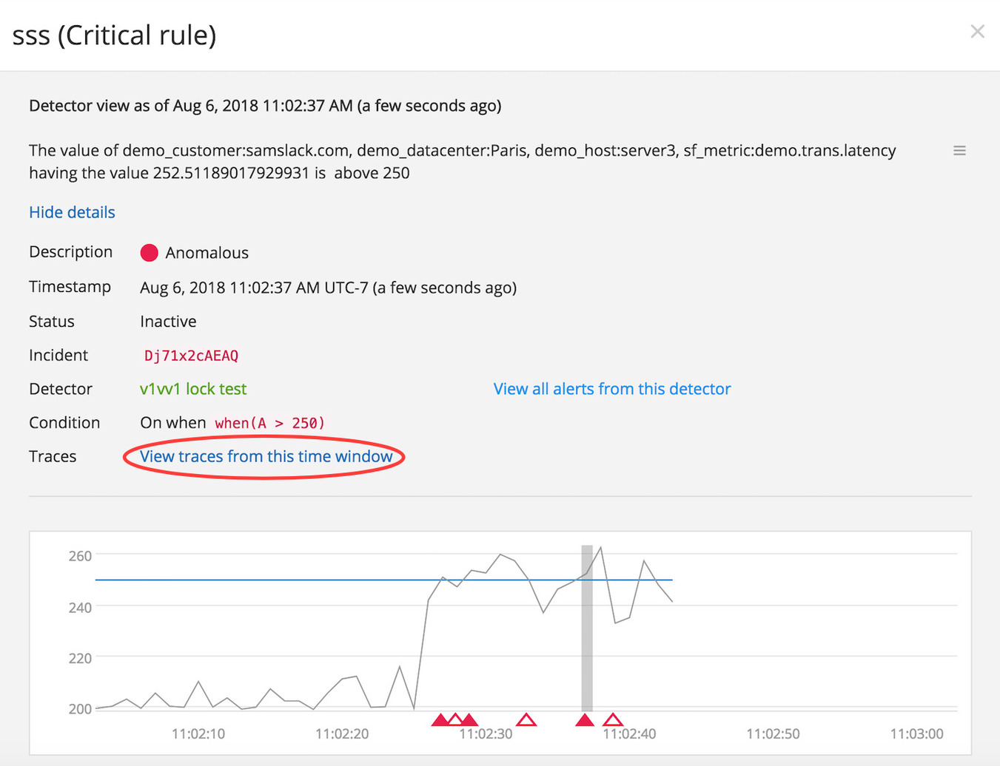
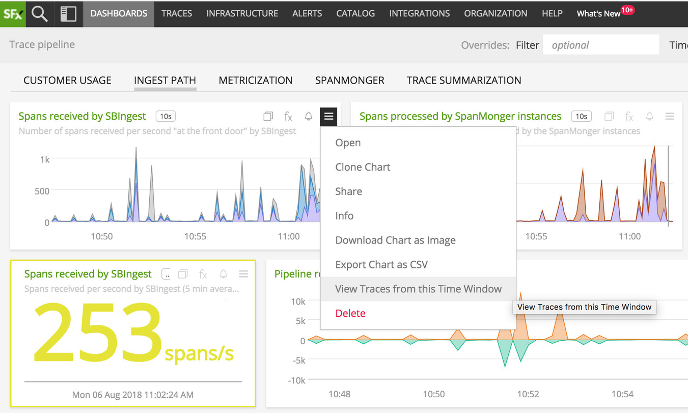
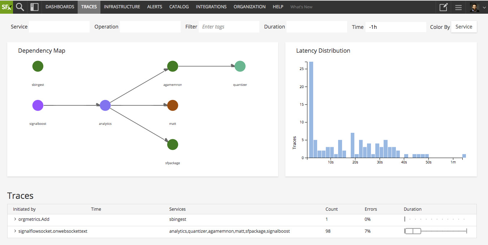
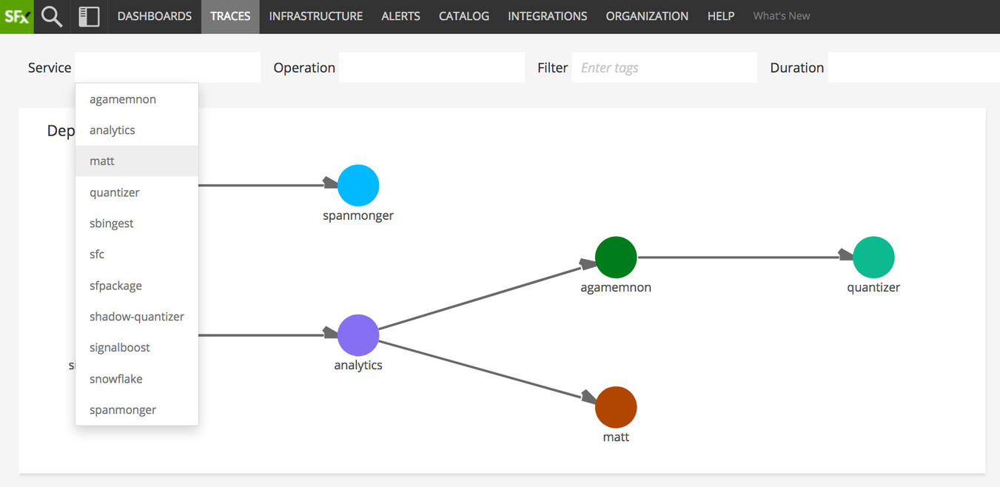
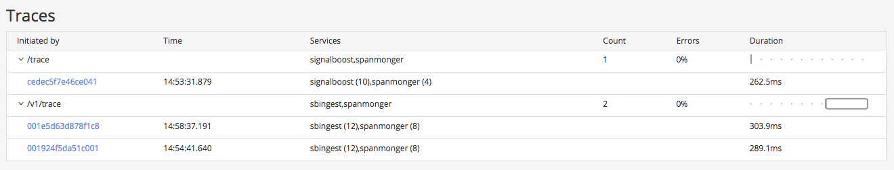
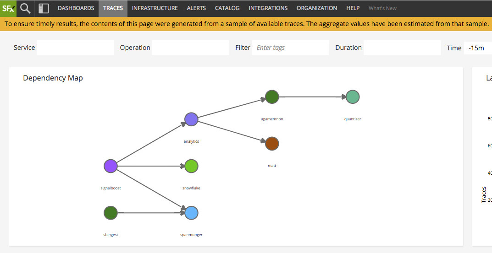
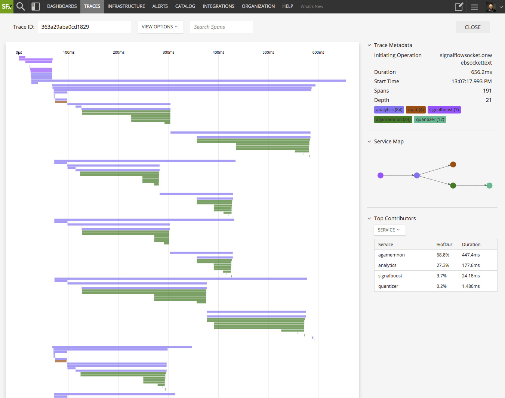
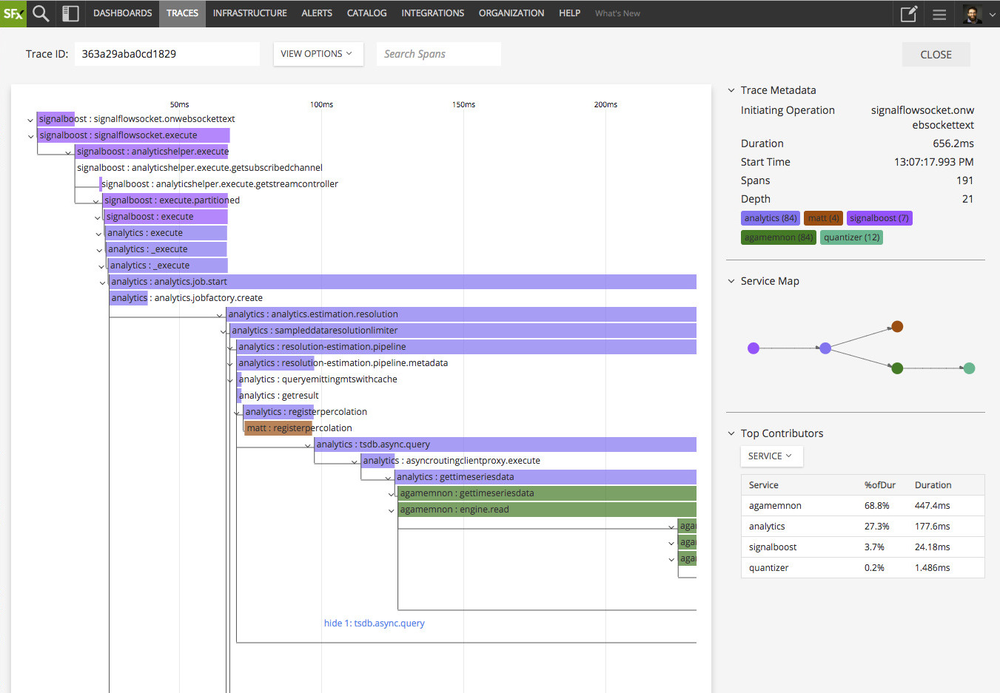
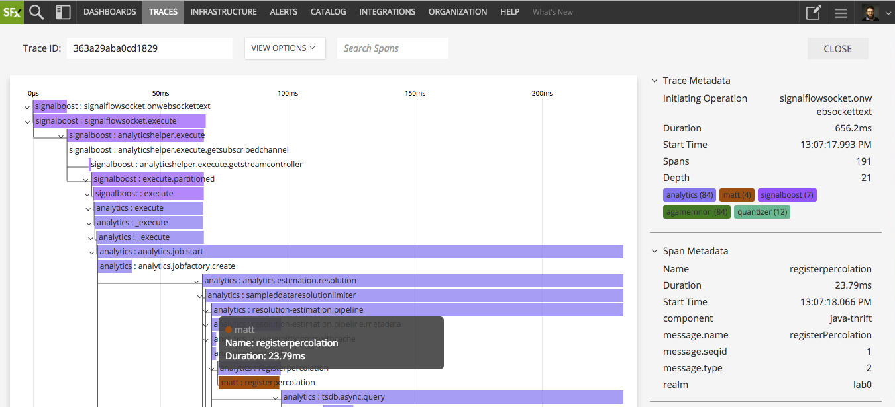

# Distributed Tracing & Microservices APM Early Access Program

## Overview

New applications and existing monolithic apps are being decomposed into
distributed service-oriented/microservices-based software systems using various
tools, languages, frameworks and cloud services. These new environments require
a new way to understand user transactions that flow across service boundaries
with a transaction going through 10s/100s of services to complete a single user
request.

SignalFx's Distributed tracing will offer unique insights into distributed
applications - performance and troubleshooting - complementing metrics-based
monitoring approach; by utilizing our class-leading real-time metrics analytics
platform, we intend to make distributed tracing useful beyond end-to-end
troubleshooting and uplevel it to a performance optimization solution by
applying real-time analytics to span/trace data.

Some key functionality we intend to deliver over the coming year includes:

* Ingesting, storing and visualizing instrumentation agnostic trace data
* Rapid end-to-end troubleshooting with service maps, slice/dice
  high-cardinality spans, trace latency histogram
* RED Metrics for spans, per end-point & service profiles and built-in alerts
* Dependency-aware alerting & troubleshooting to get you to root cause rapidly
* Infra metrics related to spans/traces to help with problem isolation quickly

## Early Access Program

Our Early Access Program (EAP) for Distributed Tracing is intended for early
interaction, engagement and feedback with a select set of customers that we
consider design partners on the journey to delivering a best in class
distributed tracing and microservices APM solution. This EAP will give you
access to new features as we're building them - as such, they should be
considered "alpha quality": you may experience bugs or user experience nits
along the way and we'll be looking forward to your feedback as we continue to
build this new and exciting facet of SignalFx's offering.

We will continue to rapidly add functionality mentioned above with a
monthly/quaterly cadence and expect to receive candid feedback from this Early
Access group so we can continue to iterate towards an outstanding product that
solves customer problems in truly unique, innovative ways.

### Feedback and support requests

For the duration of this Early Access Program for our Distributed Tracing & APM
features, please refrain from using our normal support channels and direct all
your feedback and questions via email to `tracing-feedback@signalfx.com`.

## Instrumentation

Akin to our approach for metrics instrumentation, SignalFx intends to remain as
instrumentation-agnostic as possible, leveraging open-source and open standards
for client-side tracing instrumentation and wire formats. We intend to ingest
spans in Zipkin's JSON formats (both v1 and v2) as well as Jaeger Thrift format.
We've developed a normalized data model to ingest & represent different formats
so you can use SignalFx to provide powerful real-time data exploration
capabilities and easy-to-use trace visualization and analysis features for the
instrumentation of your choice. You'll find more details and examples for how to
instrument and export spans to SignalFx in our
[tracing-examples](https://github.com/signalfx/tracing-examples) repository.

<p align="center">
  <a href="https://opentracing.io">
  </a>
  &nbsp;&nbsp;
  <a href="https://jaegertracing.io">
  </a>
  &nbsp;&nbsp;
  <a href="https://zipkin.io">
  </a>
    &nbsp;&nbsp;
  <a href="https://opencensus.io">
  </a>

</p>

## Sending trace data to SignalFx

Listed below are three options to send trace data to SignalFx. 

The first two options, sending directly to our Trace Ingest API or via
the Metric Proxy, should only be used for limited PoC/testing. The third
option described below, using the SignalFx Smart Gateway, is the 
recommended production deployment. It enables tail-based sampling by
analyzing all traces in your environment and keeping the ones that matter
most i.e. traces with higher than expected latency & errors. 


### Sending directly to our Trace Ingest API (only for "Limited PoC / Testing" with small trace volume)

SignalFx's ingest API now exposes a new endpoint for ingesting trace data,
available at `https://ingest.signalfx.com/v1/trace`. As of June 2018, this
endpoint accepts lists of spans encoded in [Zipkin's JSON
formats](https://zipkin.io/zipkin-api/) (both v1 and v2 encodings) or Jaeger
Thrift format.

Like the rest of SignalFx's APIs, you need to provide a valid `X-SF-Token`
header. You may also compress the payload with GZip and set the
`Content-Encoding: gzip` as necessary.

The endpoint will return a JSON document describing how many spans were valid
and accepted, and what spans were rejected (and for what reason), if any.

```
POST /v1/trace HTTP/1.1
Host: ingest.signalfx.com
X-SF-Token: <your-token>
Content-Type: application/json

[{...},{...},{...}]

HTTP/1.1 200 OK
Content-Length: 24
Content-Type: application/json; charset=utf-8

{"invalid":{},"valid":3}
```

### Metricproxy (only for "Limited PoC / Testing" with small trace volume)

If you want to use the SignalFx
[Metricproxy](https://github.com/signalfx/metricproxy), your already existing
SignalFx listener and forwarder configurations can be used to forward trace data
to our ingest endpoint.  Make sure that you upgrade to version 0.10.11 or above
of the metricproxy to get support for trace data in both Jaeger and Zipkin
formats.

Once you have configured the metricproxy with the listener configuration below,
simply point your tracers to report spans to `<proxyhost>:8080/v1/trace`.

```
{
    "ListenAddr": "0.0.0.0:8080",
    "Type": "signalfx"
}
```

### Smart Gateway (recommended in production; enables tail-based sampling)

If you're looking to use the SignalFx Smart Gateway, Get the SignalFx 
Smart Gateway binary from SignalFx (smart-gateway), and follow the 
deployment steps mentioned at the following link for metrics proxy: 
https://github.com/signalfx/metricproxy

To enable Smart Sampling you will need to add a stanza to your config file like
the example below. The only value you should have to configure is where the
Smart Gateway writes out state when restarting (the `BackupLocation`). The
configuration file needs to be placed at `/etc/sfdbconfig.conf`.

```json
{
  "StatsDelay": "10s",
  "LogDir": "/var/log/sfproxy",
  "ListenFrom": [
    {
      "Type": "signalfx",
      "ListenAddr": "0.0.0.0:8080"
    }
  ],
  "ForwardTo": [
    {
      "type": "signalfx",
      "DefaultAuthToken": "PUTYOURTOKENHERE",
      "Name": "smart-gateway",
      "TraceSample": {
        "BackupLocation": "/var/config/sfproxy/data"
      }
    }
  ]
}
```

Where `/var/log/sfproxy` is where you want logs to go, and
`/var/config/sfproxy/data` is a good location to save data to for persistent
restarts. You can also change the `Name` to some identifier of your choosing.

You can then point your applications to report their trace spans to
`<that machine>:8080/v1/trace`. You can also send datapoints to
`<that machine>:8080/v2/datapoint` and events to
`<that machine>:8080/v2/event` if you want to use one Smart Gateway for
everything.

#### Instance sizing

Recommended instance sizing to run the Smart Gateway are as follows, based
on your expected volume of trace spans per minute (SPM):

|SPM|AWS EC2 Type|
|---|---|
|>2M|c5.18xlarge|
|1-2M|c5.9xlarge|
|250k-1M|c5.4xlarge|
|<250k|c5.2xlarge|

### About timestamps and durations

Note that span timestamps represent _microseconds_ since UTC Epoch, and span
durations are expressed in _microseconds_ as well. Trace and span data returned
by SignalFx's APIs will also have timestamps and durations expressed in
microseconds.

### Span validation

SignalFx checks several elements of the received spans to make sure they are
valid and respect certain limitations. Spans that do not comply to the following
rules are not accepted, and their span IDs are provided in the trace ingest
API's response.

* the span's `id` must be present and must be a valid 16-character hexadecimal
  string
* the `traceId` must be present and must be a valid 16-character or 32-character
  hexadecimal string
* the `parentSpanId`, if provided, must be a valid 16-character hexadecimal
  string
* the span's `name` must be present and must be a unicode string no longer than
  1024 characters, and that does not contain any single or double quotes (same
  rules as for metric names)
* the span's timestamp must be no older than your [data
  retention](#data-retention) and must not be more than 1 hour into the future
  -- as a relatively loose safeguard against clock skew.
* tag keys must be unicode strings no longer than 128 characters and cannot
  start with `_` or `sf_`
* the total size of the tag keys, values and annotations must be less
  than 64kB

### Sending spans from code

Any OpenTracing-compatible `Tracer` implementation that can report spans
in Zipkin's JSON formats (v1 or v2), or in Jaeger's Thrift format can be
used to send spans to SignalFx from your applications. Here's an example
using Jaeger's Java client library:

```java
String ingestUrl = "https://ingest.signalfx.com/v1/trace";
String accessToken = "...";
String serviceName = "...";

// Setup the HttpSender to report to SignalFx with the access token
OkHttpSender.Builder senderBuilder = OkHttpSender.newBuilder()
        .compressionEnabled(true)
        .endpoint(ingestUrl);

senderBuilder.clientBuilder().addInterceptor(chain -> {
    Request request = chain.request().newBuilder()
            .addHeader("X-SF-Token", accessToken)
            .build();
    return chain.proceed(request);
});

OkHttpSender sender = senderBuilder.build();

// Build the Jaeger Tracer instance, which implements the OpenTracing
// Tracer interface.
Tracer tracer = new JaegerTracer.Builder("service-name")
        // This configures the tracer to send all spans, but you will
        // probably want to use something less verbose.
        .withSampler(new ConstSampler(true))
        .withReporter(new ZipkinV2Reporter(AsyncReporter.create(sender)))
        .build();

// It is considered best practice to at least register the GlobalTracer
// instance, even if you don't generally use it.
GlobalTracer.register(tracer);
```

For a more complete example, refer to the [Jaeger
Java](https://github.com/signalfx/tracing-examples/jaeger-java/)
example. You'll also find other examples for Jaeger tracing libraries
and for other programming languages in this
[tracing-examples](https://github.com/signalfx/tracing-examples)
repository.

### Metrics about received spans

SignalFx emits two counter metrics into your organization,
`sf.org.numSpansReceived` and `sf.org.numSpansReceivedByToken`, to help you
visualize how many spans you are sending to SignalFx. In the future, we'll also
publish metrics about invalid spans that were rejected (and why).

## Data retention

Full trace data is kept for eight days, relative to the spans' timestamp (and
not the time at which it was received). Note that for the duration of this Early
Access Program, SignalFx makes no guarantees as to the availability and
persistence of the trace data. We will provide clear SLAs and data retention
limits as we approach GA.

## Exploring trace data

For this early release of SignalFx's distributed tracing and microservices APM
features, we focused on fulfulling the troubleshooting workflow: allowing you to
work your way from an alert or an anomaly witnessed in a chart to a
representative trace in which you can pinpoint the root cause of the issue.

Alerts viewed in SignalFx will now show a _"View traces from this time window"_
link as part of the alert details. Similarly, charts' hamburger menu offers a
_"View Traces from this time window"_ option. Both take you to the new _Traces_
page, carrying over the relevant time context.

<p align="center">
  
  &nbsp;
  
</p>

> Upcoming: more context and metadata will be captured from the alert or chart
> to further scope the search to the relevant traces.

### The Traces page

<p align="center">
  
</p>

The _Traces_ page is where you can search, filter and visualize your trace data.
It can be reached by selecting _TRACES > All Traces_ in the navigation menu, or
directly at `https://app.signalfx.com/#/traces`. The top bar offers several
filters that, together, can help you surface a particular subset of traces that
you're interested in:

- the _Service_ filter will match traces that contain spans going through the
  selected service(s);
- the _Operation_ filter will match traces that contain spans of the selected
  name(s);
- the _Filter_ field allows you to further constrain the search to spans
  containing the given `key:value` pair metadata tags;
- the _Duration_ filter will match traces in the specified range (for example:
  `> 3s` for traces longer than 3 seconds, or `100ms to 2s` for traces lasting
  between 100ms and 2s);
- last but not least, the _Time_ filter allows you to select the time window in
  which to search.

<p align="center">
  
</p>

> Upcoming: multi-select for services and operation names, an easier experience
> for selecting and writing tags to filter on, and auto-suggest of tag names.

The contents of the _Traces_ page are computed and rendered from the results of
this search. The _Dependency Map_ is dynamically generated, representing the
services and interactions between those services captured by the matched traces.
Hovering over nodes and edges will reveal additional information about those
services and interactions: number of requests/traces, error rate and average
duration.

By default, the map is colored by service. Each service is assigned a color in a
stable manner. When viewing a trace, coloring by service will represent those
services by the same color. Alternatively, you can choose to color the map
according to the error rate: a 0% error rate will color nodes green, and
progressively more yellow, orange and red as the error rate increases to 100%.

The _Latency Distribution_ histogram represents the distribution of durations of
the matched traces. It allows you to quickly identify abnormal traces, long tail
issues, or bi-modal distributions.

> Upcoming: the ability to select an area of the distribution to filter for
> traces with a duration within the selected range.

The bottom of the page shows a representative sample of the matched traces (or
all the results, if there aren't too many of them). The traces are grouped by
initiating operation. Each group shows the services involved in those traces,
the error rate, and a box-and-whisker representation of the distribution of the
traces within the group.

<p align="center">
  
</p>

Clicking on a group's heading will expand and collapse the group, revealing the
individual traces. Each entry provides a link to view the trace, the exact time
of the trace (in your configured timezone), the services traversed by the trace
and how many spans were recorded on each service, as well as the precise
duration of the trace.

### Result sampling

Because the number of traces matching your search criteria might be very large,
SignalFx will compute the dependency map and distribution histogram on a random
sample of those results. The request counts, error rates and latency averages
and distrubions are all computed from those results as well. When this happens,
you will see the following banner at the top of the page:

<p align="center">
  
</p>

If you search is constrained enough to fit within that sample size, the banner
will disappear. During the Early Access Program, this sample size is set fairly
low (around 5000 results); we'll continue to work on raising that number to
improve the accuracy of the distribution histogram.

Additionally, to avoid showing unmanageably large lists in the traces table, we
further reduce the number of individual results that are returned to populate
the grouped traces table.

### Viewing a trace

You can view an individual trace either by finding one from the _Traces_ page or
by entering its trace ID in the designated input field. You can also link
directly to a trace by going to `https://app.signalfx.com/#/trace/<traceId>`.

One of the main goals of the trace view is to guide you to the interesting
sections of the trace as quickly as possible. This is why when the trace is
loaded, you start with a "zoomed out" view of the trace's structure in the main
area. If the trace doesn't have a lot of spans and fits in the view, it will be
automatically zoomed in. The _View Options_ dropdown allows you to control
collapsing options, for example to collapse all the non-RPC spans, leaving only
the inter-service interactions shown.

The sidebar to the right contains metadata about the trace itself, a summary of
the services involved in this transaction and a map of those services. Finally,
the _Top Contributors_ section offers insights into which service(s), or which
operation(s), are the main drivers of latency in this trace based on how much
time they contribute to the overall trace. This can help you quickly identify a
problematic service or expensive operation in the path of that transaction.

<p align="center">
  
</p>

Scrolling into the main area controls the zoom. Span labels will appear when you
reach maximum zoom. After that, you can continue to scroll to control the "time
dilation", allowing you to see short duration spans in more details. You can pan
around the trace with click-and-drag.

When zoomed in, span labels are rendered, showing the name of the service and
the name of the operation that was captured by each span. Parent/child
relationships between spans are also represented by the lines connecting the
spans together. Each sub-tree can be individually collapsed or expanded by
clicking the downwards caret to the left of a span with children.

<p align="center">
  
</p>

#### Span details

Hovering over spans in the main view reveals a tooltip with a quick summary of
the span. To view the full details of a span's metadata, select a span by
clicking on it; this will open a new section called _Span Metadata_ in the
sidebar. All the span's metadata tags and annotations will be displayed there.

> Upcoming: improved and intelligent rendering of span metadata tag values based
> on the tag name, in particular for tags known to OpenTracing.

You can deselect a span by clicking back on it, or by clicking anywhere in the
empty space of the trace view.

<p align="center">
  
</p>
