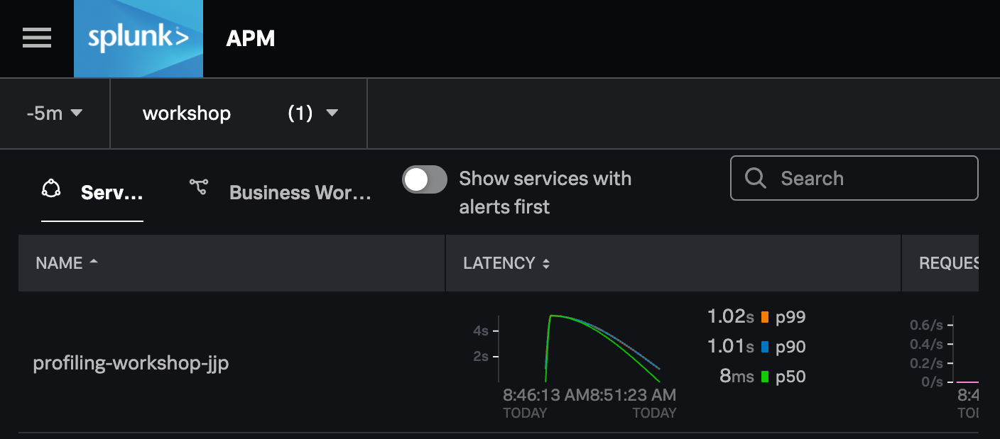
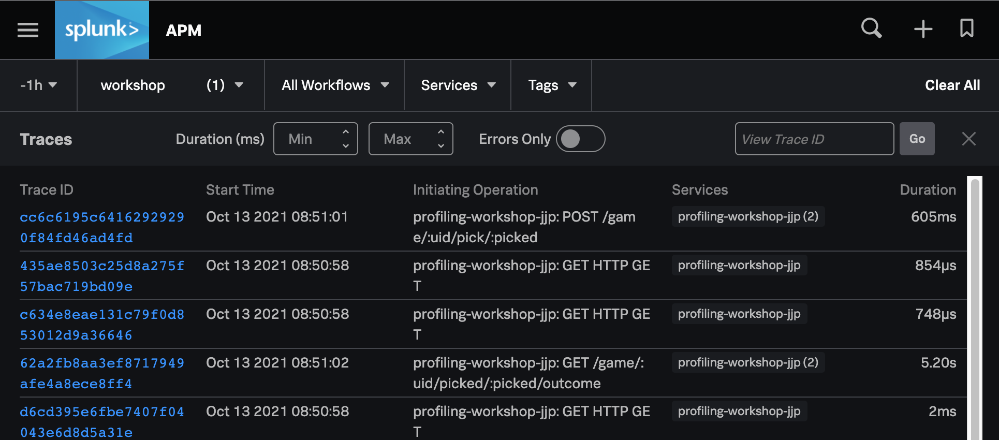

# AlwaysOn Profiling Workshop

## Part 1: Getting Started

In this section, we will learn how to build and run the
sample application and how to ingest telemetry through the collector.

### Clone the repo

From a new shell, clone this repo by running the following:

```
$ git clone https://github.com/signalfx/tracing-examples.git
$ cd tracing-examples/profiling/workshop
```
The rest of the workshop will take place in this directory.

### Build the example service

Time to build the sample application service. Run the following to create
a single runnable jar.

```
$ ./gradlew shadowJar
```

Near the end of the output it should say `BUILD SUCCESSFUL`. Let's make sure the jar
got built:

```
$ ls -l build/libs/
total 6152
-rw-r--r--  1 user  group   2.8M Nov 01 14:01 profiling-workshop-all.jar
```


Great! We now have an executable jar containing our sample app. We will run it shortly,
but first we need to...

### Fire up a Collector

The Splunk Distribution of OpenTelemetry Java Instrumentation agent sends its telemetry
through an OpenTelemetry Collector. In order to get data ingested into the Splunk 
Observability Cloud, we need an available collector. In a production environment,
this might be running on a separate host or deployed as a k8s sidecar. For our workshop,
we will just run one locally on our own machine inside docker.

The collector must be configured to accept OTLP logs and export them via [HEC format](https://github.com/open-telemetry/opentelemetry-collector-contrib/tree/main/exporter/splunkhecexporter).
For this workshop, we've provided a configuration that has this set up for you. 
If you want to see the details, take a peek in `etc/collector.yaml`.

Before you start the collector, you will need an access token.
You can find an access token by logging into the Splunk Playground, 
expanding the hamburger menu, and choosing "Organization Settings" -> "Access Tokens".


Expand the "Workshop" token and click on the blue "Show Token". Then click "Copy" to have it copied
to the clipboard.


Now we can run the collector. For the purposes of this workshop, we assume that 
you are working in the "Splunk Playground", which is `us0`. If you are in another 
realm, change `us0` below to your specific realm.

Run the following, substituting `<SPLUNK_TOKEN>` for youractual token value copied above:

```
$ docker run -d --rm --name collector \
    -v $(pwd)/etc/collector.yaml:/etc/otel/config.yaml \
    -p 4317:4317 \
    -e SPLUNK_TOKEN=<SPLUNK_TOKEN> \
    -e SPLUNK_REALM=us0 \
    otel/opentelemetry-collector-contrib:0.36.0 
```

_NOTE_: The `$(pwd)` above inserts the current directory and is expected to be the
`workshop` directory. If you are on Windows, you may need to substitute `$(pwd)` with
the full literal path to the workshop directory.

If successful, docker prints out the container guid (long hex number). Confirm that it is working 
by running:
```
$ docker ps --filter name=collector
CONTAINER ID   IMAGE                                         COMMAND                  CREATED         STATUS         PORTS                       NAMES
44cf54983df4   otel/opentelemetry-collector-contrib:0.36.0   "/otelcontribcol --c…"   2 minutes ago   Up 2 minutes   4317/tcp, 55679-55680/tcp   collector
```

### Download splunk-otel-java instrumentation

We want to run the application with the Splunk distribution of OpenTelemetry java instrumentation.
Download the latest release:

```
$ curl -L -o splunk-otel-javaagent-all.jar https://github.com/signalfx/splunk-otel-java/releases/latest/download/splunk-otel-javaagent-all.jar
```

### Run the application

Now it's time to run the application. In order to identify your application instance from 
other workshop participants, we need to select a service name. Recommend choosing 
`profiling-workshop-<xxx>` where `<xxx>` are your initials or username. Use this
service name in the command below:

```
$ java -javaagent:splunk-otel-javaagent-all.jar \
    -Dotel.resource.attributes=deployment.environment=workshop \
    -Dotel.service.name=profiling-workshop-<xxx> \
    -jar build/libs/profiling-workshop-all.jar
```

To verify that the service is working, visit http://localhost:9090. You should be
met with The Door Game intro screen. Play through a couple of times to get the 
feel for the application flow. Good luck!

### Confirm spans are being ingested

We can first check in on the collector to verify that it is receiving trace data.
Let's look in the logs:

```
$ docker logs collector
```

Near the bottom of the logs you should hopefully see output that looks like this:

```
2021-10-12T23:19:20.004Z	INFO	loggingexporter/logging_exporter.go:41	TracesExporter	{"#spans": 2}
```

You should see one or more lines like the above and no errors. If you have errors, 
check that you have started the collector with the correct token and realm
(as shown above). 

We haven't turned the profiler on yet, so we shouldn't see any logs being exported yet.

It's time to see the service in APM. [Visit this link](https://app.signalfx.com/#/apm?endTime=Now&environments=workshop&filter=&job=full&startTime=-15m)
and scroll to the bottom to see the list of services.



Find your service in the list and click the name to visit the Troubleshooting view, then click
"Traces" on the right-hand side of the screen. This will take you to the list of traces for 
your service:



Feel free to look at some of the traces and get a brief sense of the web/REST operations
performed by the service.

# Conclusion of Part 1

Go ahead and play a few games. Have you noticed any slowness in certain areas of the
gameplay? (Hint: try using door 3 as your final choice).

## What did we accomplish?

* We performed the initial workshop setup.
* We learned how to run the collector locally and how verify its proper operation by inspecting the logs.
* We learned how to build and start the sample application.
* We learned how to wire up the latest Splunk java instrumentation to our sample application.
* We learned how to find our service in APM in the Splunk Observability Cloud and how to view trace details.

## Next steps

[Click here to go on to part 2](02_enable_profiler.md), where we 
will enable the profiler and look at its output.