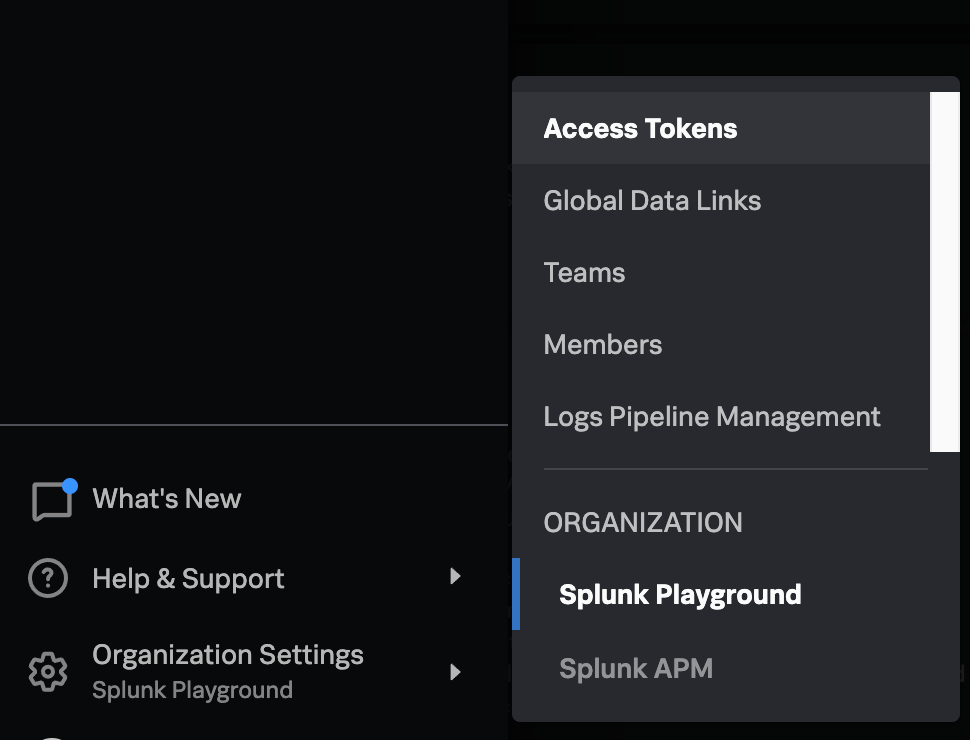
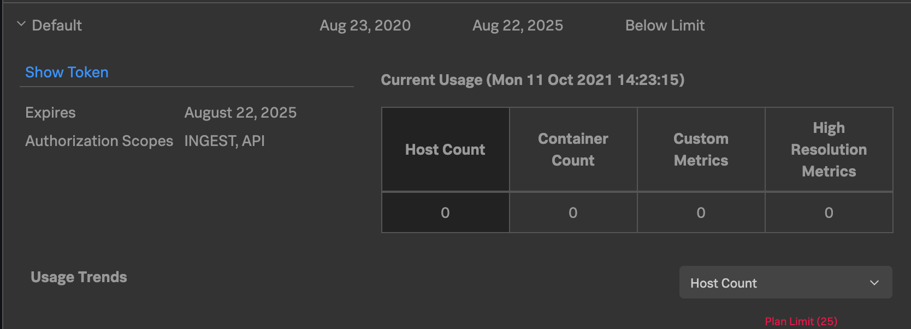

# Profiling Workshop

## Part 1: Getting Started

In this section, we will learn how to build and run the
sample application and how to ingest telemetry through the collector.

### Clone the repo

From a new shell, clone this repo by running the following:

```
$ git clone https://github.com/signalfx/tracing-examples.git
$ cd tracing-examples/profiling/workshop
```
The rest of the workshop will take place in this directory.

### Build the example service

Time to build the sample application service. Run the following to create
a single runnable jar.

```
$ ./gradlew shadowJar
```

Near the end of the output it should say `BUILD SUCCESSFUL`. Let's make sure the jar
got built:

```
$ ls -l build/libs/
total 6152
-rw-r--r--  1 user  group   2.8M Nov 01 14:01 profiling-workshop-all.jar
```


Great! We now have an executable jar containing our sample app. We will run it shortly,
but first we need to...

### Fire up a Collector

The Splunk Distribution of OpenTelemetry Java Instrumentation agent sends its telemetry
through an OpenTelemetry Collector. In order to get data ingested into the Splunk 
Observability Cloud, we need an available collector. In a production environment,
this might be running on a separate host or deployed as a k8s sidecar. For our workshop,
we will just run one locally on our own machine inside docker.

The collector must be configured to accept OTLP logs and export them via [HEC format](https://github.com/open-telemetry/opentelemetry-collector-contrib/tree/main/exporter/splunkhecexporter).
For this workshop, we've provided a configuration that has this set up for you. 
If you want to see the details, take a peek in `etc/collector.yaml`.

Before you start the collector, you will need an access token.
You can find an access token by logging into the Splunk Playground, 
expanding the hamburger menu, and choosing "Organization Settings" -> "Access Tokens".



Expand one of the tokens and click on the blue "Show Token". Then click "Copy" to have it copied
to the clipboard.



Now we can run the collector. Run the following, substituting `<SFX_TOKEN>` for your 
actual token value copied above:

```
$ docker run -d --rm --name collector \
    -v $(pwd)/etc/collector.yaml:/etc/otel/config.yaml \
    -e SFX_TOKEN=<SFX_TOKEN> \
    -e SFX_REALM=us0 \
    otel/opentelemetry-collector-contrib:0.36.0 
```

_NOTE_: The `$(pwd)` above inserts the current directory and is expected to be the
`workshop` directory. If you are on Windows, you may need to substitute `$(pwd)` with
the full literal path to the workshop directory.

If successful, docker prints out the container guid (long hex number). Confirm that it is working 
by running:
```
$ docker ps --filter name=collector
CONTAINER ID   IMAGE                                         COMMAND                  CREATED         STATUS         PORTS                       NAMES
44cf54983df4   otel/opentelemetry-collector-contrib:0.36.0   "/otelcontribcol --c…"   2 minutes ago   Up 2 minutes   4317/tcp, 55679-55680/tcp   collector
```

### Download splunk-otel-java instrumentation

We want to run the application with the Splunk distribution of OpenTelemetry java instrumentation.
Download the latest release:

```
$ curl -L -o splunk-otel-javaagent-all.jar https://github.com/signalfx/splunk-otel-java/releases/latest/download/splunk-otel-javaagent-all.jar
```

### Run the application

Now it's time to run the application. In order to identify your application instance from 
other workshop participants, we need to choose a few items:
* environment name
* service name

```
$ java -javaagent:splunk-otel-javaagent-all.jar build/libs/profiling-workshop-all.jar
```