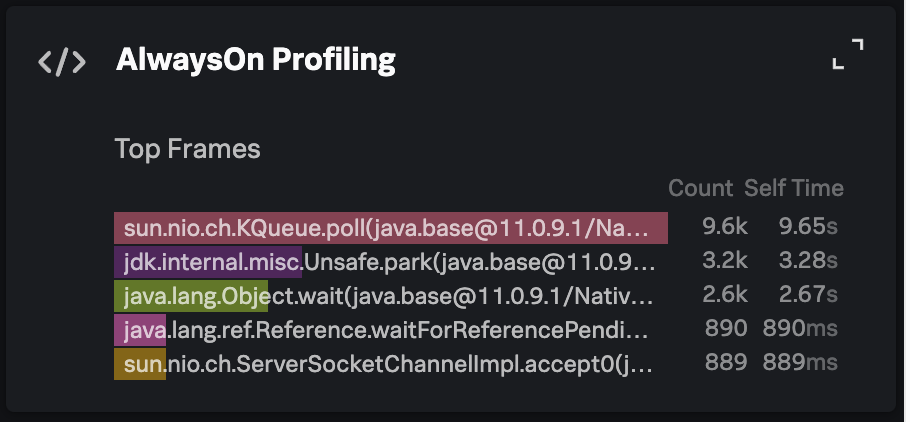
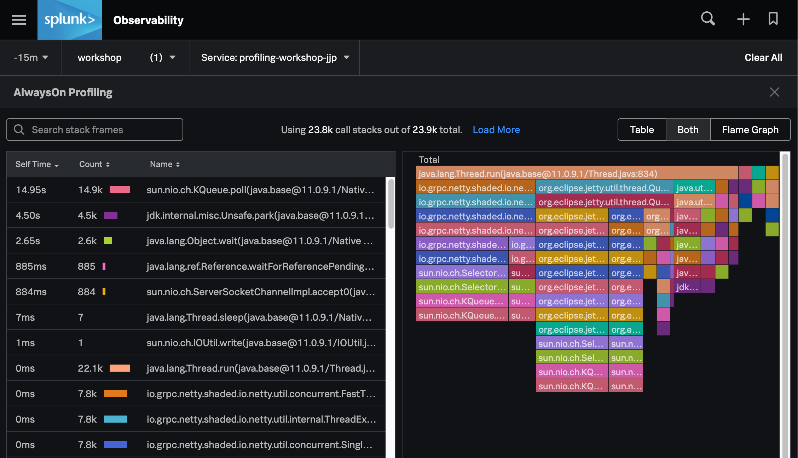
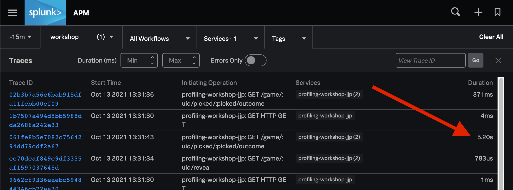
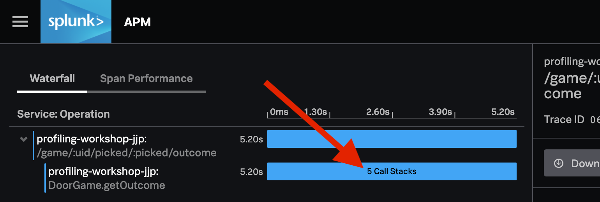

# AlwaysOn Profiling Workshop

## Part 2: Enabling the Profiler

In this section, we will learn how to enable the profiler, verify its operation,
and view its results in the Splunk Observability Cloud.

### Restart the sample app

If your sample app is still running from the previous section, go ahead and stop it
by pressing control+c (^c).

We will need to pass an additional configuration argument to the Splunk java agent in order to 
enable the profiler. The configuration is [documented here](https://github.com/signalfx/splunk-otel-java/tree/main/profiler#configuration-settings)
in detail, but for now we just need one single setting:

`splunk.profiler.enabled=true`

While it is also possible to use an environment variable, we will simply pass this
as a java system property by adding `-D`. Modify the run command from before, but add
the config setting to enable the profiler. Don't forget to substitute `<profiling-workshop-xxx>`
with the service name you decided on in the previous section:

```
$ java -javaagent:splunk-otel-javaagent-all.jar \
    -Dsplunk.profiler.enabled=true \
    -Dotel.resource.attributes=deployment.environment=workshop \
    -Dotel.service.name=<profiling-workshop-xxx> \
    -jar build/libs/profiling-workshop-all.jar
```

###  Confirm operation

You should see a line in the application log output that shows the profiler being enabled:

```
[otel.javaagent 2021-11-13 10:11:12:130 -0700] [main] INFO com.splunk.opentelemetry.profiler.JfrActivator - JFR profiler is active.
```

And approximately every 16 seconds you should see a line in the output that ends with this:

```
New jfr file detected: ./otel-profiler-2021-11-13T13_04_42.jfr
```

So far so good. Let's check the collector logs to verify that it is exporting
the profiling data as log messages. Just like in the previous section, we will
run `docker logs collector`.

You should see some collector output lines that look like this:

```
2021-11-13T17:12:10.649Z	INFO	loggingexporter/logging_exporter.go:71	LogsExporter	{"#logs": 250}
2021-11-13T17:12:20.707Z	INFO	loggingexporter/logging_exporter.go:71	LogsExporter	{"#logs": 161}
2021-11-13T17:12:26.554Z	INFO	loggingexporter/logging_exporter.go:71	LogsExporter	{"#logs": 250}
```

The thing to look for there is "LogsExporter" and a positive number of `#logs` being exported.

### Profiling in APM

Visit http://localhost:9090 and play a few more rounds of The Door Game.
Then head on over to [https://app.signalfx.com/#/apm](https://app.signalfx.com/#/apm) 
and click on the name of your service to visit the Troubleshooting view.

You may need to scroll, but in the rightmost column you should see the "AlwaysOn Profiling"
card that looks similar to this:



Click the card title to go to the AlwaysOn Profiling view. It will look something 
like this:



By default, we show both the table and [flamegraph](https://www.brendangregg.com/flamegraphs.html). 
Take some time to explore this view by doing some of the following:

* toggle between flamegraph and table views
* click a table item and notice the change in flamegraph
* navigate the flamegraph by clicking on a stack frame to zoom in, and a parent frame to zoom out
* add a search term like `splunk` or `jetty` to highlight some matching stack frames

We should note that the sample app is greatly underutilized and most of the time
is spent waiting for user input and service requests. As a result, the flame graph
should be somewhat less interesting than a high-volume, real-world production service.

### Traces with Call Stacks

Now that we've seen the profiling view, let's go back to the trace list view. We want to find a 
trace that was long enough so that we increase the chance of having sampled call stacks.
If you haven't already, you should play The Door Game enough to stick with door 3 
(either by choosing it initially and staying, or choosing another door and switching when given the chance).
You'll notice that it's slow, and it should show up at around 5s in the trace list view:



Identify the slow trace in the trace list view and click it to view the
individual trace. In the single trace view, you should see that the innermost span
`DoorGame.getOutcome` is responsible for the entire slow duration of the span.
There should be about 5 call stacks sampled during the execution of that span.



If you're up for the challenge, expand the span and explore the java stack frames on your own
before we tackle it in the next section.

# Conclusion of Part 2

We've come a long way already!

## What did we accomplish?

* We learned how to enable the profiler in the Splunk java instrumentation agent.
* We learned how to verify in the agent output that the profiler is enabled.
* We learned how to inspect the collector output to determine that log messages are flowing.
* We have explored several profiling related workflows in APM:
  * How to navigate to AlwaysOn Profiling from the troubleshooting view
  * How to explore the flamegraph and method call duration table through navigation and filtering
  * How to identify when a span has sampled call stacks associated with it

## Next steps

[Click here to go on to part 3](03_find_and_fix_slowness.md), where we
will use the profiler tools to identify the specific area of code that 
was causing our slow-down, and we will work to improve it...


