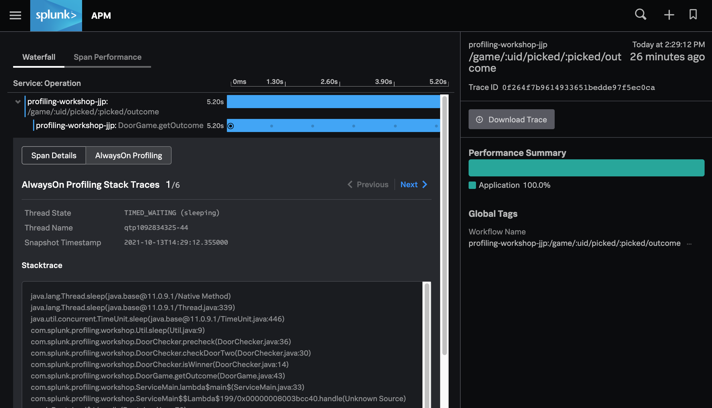

# AlwaysOn Profiling Workshop

## Part 3: Find and Fix Code

In this section, we pick up where we left off last time. 
We will use the profiling tool to explore our slow span and link it
back to the source code that caused the slowness. We will update the code to improve
the performance of this span, and we will use the APM profiling tools to verify 
that our change is successful.

### Exploring the Span

At the end of the previous section, we have identified a span that was taking more
than 5 seconds to complete. We observed that the span showed that it was linked
to 5 or more sampled call stacks. Let's proceed by clicking on the span to expand its details.



When a span does not have call stack data, we would normally just see the span details.
(you can drill into the parent stack to see this in action). When we expand the child stack, however,
we get the "AlwaysOn Profiler" stack trace details as our default view.

This view shows the name of the Thread from which the call stack was sampled.
In our case, the thread was busy sleeping and the top of the call stack will 
look something like this:

```
java.lang.Thread.sleep(java.base@11.0.9.1/Native Method)
java.lang.Thread.sleep(java.base@11.0.9.1/Thread.java:339)
java.util.concurrent.TimeUnit.sleep(java.base@11.0.9.1/TimeUnit.java:446)
com.splunk.profiling.workshop.Util.sleep(Util.java:9)
com.splunk.profiling.workshop.DoorChecker.precheck(DoorChecker.java:36)
com.splunk.profiling.workshop.DoorChecker.checkDoorTwo(DoorChecker.java:30)
com.splunk.profiling.workshop.DoorChecker.isWinner(DoorChecker.java:14)
com.splunk.profiling.workshop.DoorGame.getOutcome(DoorGame.java:43)
com.splunk.profiling.workshop.ServiceMain.lambda$main$(ServiceMain.java:33)
```

The call stack tells us a story -- reading from the bottom up, it lets us describe
what is happening inside the service code. A developer, even one unfamiliar with the 
source code, should be able to look at this call stack to craft a narrative like:
> We are getting the outcome of a game. We leverage the DoorChecker to 
> see if something is the winner, but the check for door two somehow issues
> a precheck() that, for some reason, is deciding to sleep for a long time.

This is curious. Let's use the `Next`
and `Previous` links to compare with the other sampled stacks...


We are likely to see that _every_ sample was held up in the same sleep call.
While not a smoking gun, in our case it is very likely that we want to 
investigate the `DoorChecker.precheck()` method. 

Our workshop application is left intentionally simple -- a real-world service might see the
thread being sampled during a database call or calling into an untraced external service.
It is also possible that a slow span is executing a complicated business process,
in which case maybe none of the stack traces relate to each other at all. 

The longer a method or process is, the greater chance we will have call stacks
sampled during its execution.

### Lets Fix That Bug

By using the profiling tool, we were able to determine that our application is slow
when issuing the `DoorChecker.precheck()` method from inside `DoorChecker.checkDoorTwo()`.
Let's open the `DoorChecker.java` source file in our IDE or editor.

By quickly glancing through the file, we see that there are methods for checking 
each door, and all of them call `precheck()`. In a real service, we might be uncomfortable
simply removing the `precheck()` call because there could be unseen/unaccounted side
effects.

Down on line 29 we see the following:
```java
    private boolean checkDoorTwo(GameInfo gameInfo) {
        precheck(2);
        return gameInfo.isWinner(2);
    }

    private void precheck(int doorNum) {
        long extra = (int)Math.pow(70, doorNum);
        sleep(300 + extra);
    }
```

With our developer hat on, we notice that the door number is zero based, so
the first door is 0, the second is 1, and the 3rd is 2 (this is conventional).
The `extra` value is used as extra/additional sleep time, and it is computed by taking
`70^doorNum` (`Math.pow` performs an exponent calculation). That's odd, because this means:
* door 0 => 70^0 => 1ms
* door 1 => 70^1 => 70ms
* door 2 => 70^2 => 4900ms

We've found the root cause of our slow bug! This also explains why the first two doors
weren't ever very slow. 

We have a quick chat with our product manager and team lead, and we agree that the `precheck()`
method must stay but that the extra padding isn't required. Let's remove the `extra` variable
and make `precheck` now read like this:

```java
    private void precheck(int doorNum) {
        sleep(300);
    }
```

Now all doors will have a consistent behavior. Save your work and then rebuild the application 
by running the gradle command from before:

```
$ ./gradlew shadowJar
```
And then restart the app (using your command history is probably easiest).
```
$ java -javaagent:splunk-otel-javaagent-all.jar \
    -Dotel.resource.attributes=deployment.environment=workshop \
    -Dotel.service.name=<profiling-workshop-xxx> \
    -jar build/libs/profiling-workshop-all.jar
```
And then visit The Door Game again to confirm that your fix is in place: 
http://localhost:9090/

# Conclusion of Part 3

We've reached the end of the workshop! Congratulations.

## What did we accomplish?

* We learned how to view a series of call stacks captured during a Span.
* We learned how the call stack can tell us a story and point us to suspect lines of code.
* We identified the slow code and fixed it to make it faster.

## Exploring more

Some extra things you may wish to try:

* See if you can use the profiling tool to make starting a new game faster.
* What is causing the deep spire in the flamegraph? Can you find the code that causes that?
* Write a bot or script to repeatedly play many simultaneous games? 
  * How does the continuous activity impact the shape of the flame graph?